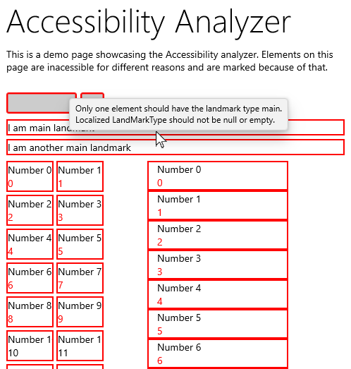

# VisualTreeAnalyzers

VisualTreeAnalyzers is a Windows Runtime Component(WRC) library to analyze and scan the visual tree of UWP apps and libraries.
The main purpose of this library is to find common errors including accessibility issues during development.

VisualTreeAnalyzers includes an accessibility scanner, classes that help with visual tree traversing and the snapshot package that helps with visual tree snapshot testing.

| Sample page without analyzer | Sample page using accessibility analyzer |
|---|---|
|||

You can find the official documentation [on the website](https://chingucoding.github.io/VisualTreeAnalyzers/website/index.html).

## Samples
This repository also contains sample projects showing the different features of the VisualTreeAnalyzers library. All samples are located inside the `samples` folder.

### VisualTreeAnalyzersSampleApp
The VisualTreeAnalyzersSampleApp is a small app showcasing different analyzers and features of VisualTreeAnalyzers.

## Building the project
To build the project, you need Visual Studio 2019 and the latest Windows 10 SDK.
The project can be build by opening the `VisualTreeAnalyzers.sln`solution.
For more information see the [development guide](./docs/development/development.md).